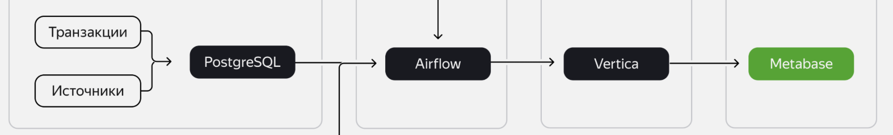
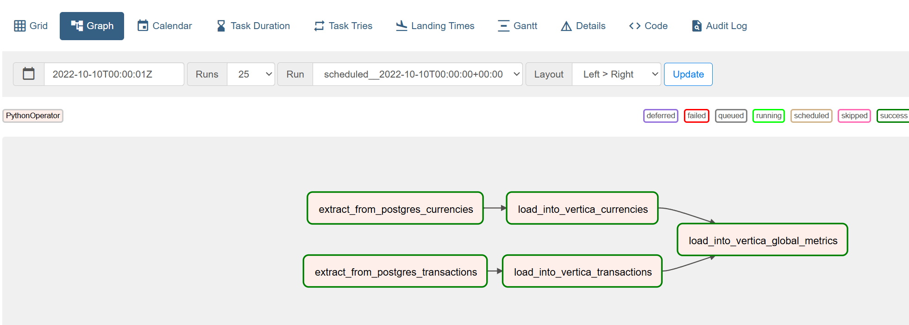
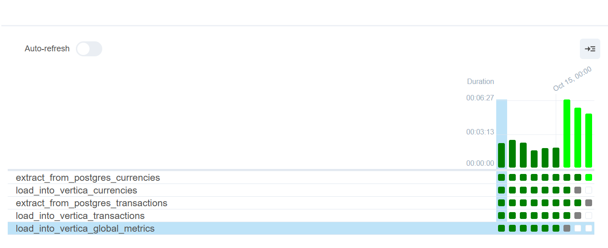
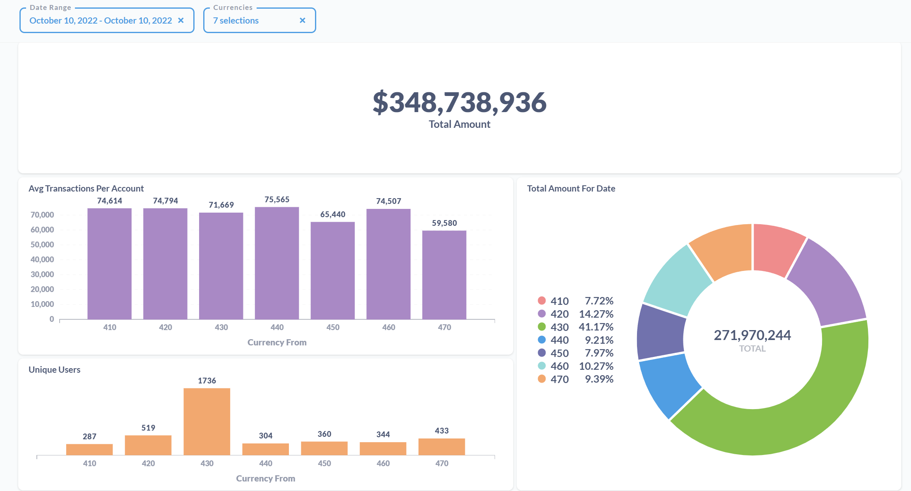
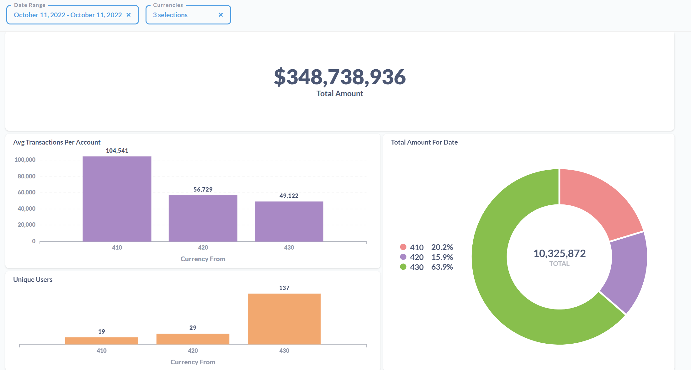
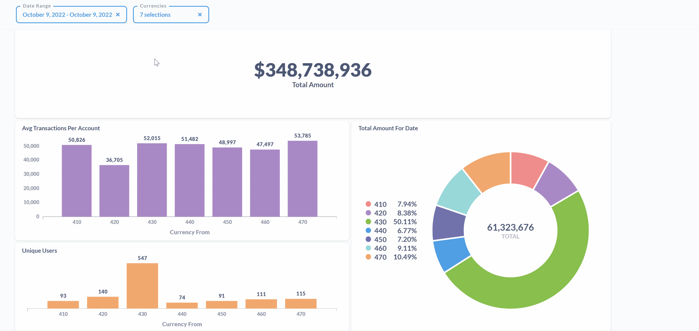

# Итоговый проект

## Описание проекта

В рамках дипломной работы разработано решение для автоматической выгрузки данных из PostgreSQL в Vertica с использованием Airflow, а также для визуализации метрик с помощью Metabase. Процесс включает в себя автоматизацию извлечения, трансформации и загрузки данных (ETL), а также представление бизнес-метрик на интерактивном дашборде.

## Структура репозитория

```DE-PROJECT-FINAL/
├── src/
│   ├── dags/
│   │   └── diploma_dag.py
│   ├── img/
│   │   ├── Airflow1.png
│   │   ├── Airflow2.png
│   │   ├── Metabase1.png
│   │   ├── Metabase2.png
│   │   ├── Structure.png
│   │   └── Animation.gif
│   └── sql/
│       ├── DDL_currencies.sql
│       ├── DDL_global_metrics.sql
│       ├── DDL_transactions.sql
│       └── SQL_global_metrics.sql
└── README.md
```

## Выбранная структура

В своей дипломной работе я выбрал способ выгрузки данных из базы данных PostgreSQL в базу данных Vertica с помощью Airflow.



1. __PostgreSQL__: Содержит исходные данные, которые требуется выгрузить.
2. __Vertica__: Целевая база данных для хранения данных.
3. __Airflow__: Используется для автоматизации процессов извлечения из PostgreSQL, трансформации и загрузки данных в Vertica.
4. __Metabase__: Используется для визуализации итоговых дашбордов.


Для этого была поднята локальная инфраструктура с Metabase и Airflow в докере.

Все конфигурационные данные для подключения к внешним Vertica и PostgreSQL были добавлены в Airflow.

## Vertica

В Vertica были созданы таблицы ```currencies``` и ```transactions``` в схеме STG и таблица ```global_metrics``` в схеме DWH.

Скрипты по их созданию находятся в ```src/sql```

Схемы в Vertica: 
```STV2024101049__DWH```
```STV2024101049__STAGING```

## Airflow DAG

DAG находится по пути ```src/dags/diploma_dag.py```

DAG состоит из следующих задач:
1. Извлечение данных о валютах из PostgreSQL.
2. Извлечение данных о транзакциях из PostgreSQL.
3. Загрузка данных о валютах в Vertica.
4. Загрузка данных о транзакциях в Vertica.
5. Обновление витрины global_metrics.

При создании DAG решил не разделять задачи по заполнению STG слоя и слоя с витриной на два отдельных DAG, чтобы после успешного завершения заполнения STG слоя, новые данные сразу использовались для заполнения витрины ```global_metrics```.

__Граф с задачами__:


__Демонстрация выполнения по дням__:


## Логика заполнения таблицы global_metrics

Файл с запросом находится по пути ```src/sql/SQL_global_metrics.sql```

В задании явно не указываются, транзакции с какими статусами нужно брать для расчета конечных метрик.

Принял решение брать транзакций с любым статусом, при этом избавился от дублирующихся статусов одной транзакции, оставляя последнюю по времени запись, чтобы одна транзакция не считалась несколько раз.

Также перевел центы в доллары для более удобного визуального представления в Metabase.

## Дашборд в Metabase

Создал 4 графика в Metabase для бизнес метрик.



- Верхний график отображает общий оборот компании в долларах.

- Фиолетовый график визуализирует метрику среднего объема транзакций на пользователя.

- Оранжевый график визуализирует метрику количества уникальных пользователей, которые совершают транзакции в валютах.

- Круговая диаграмма визуализирует метрику суммы переводов с возможностью смотреть общую сумму и выбирать отдельные валюты через фильтр.

__Нижние три графика фильтруются по дате и по выбранным валютам__:




__Демонстрация фильтрации в Metabase__:



